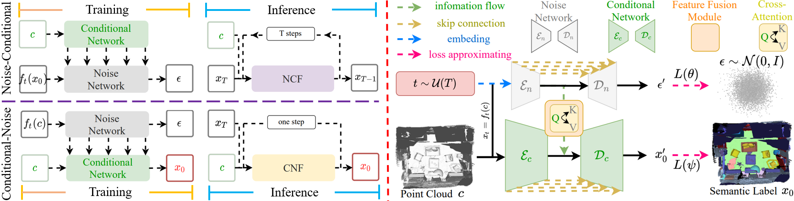

# CDSegNet

This repo is the official project repository of the paper **_An End-to-End Robust Point Cloud Semantic Segmentation Network with Single-Step Conditional Diffusion Models_**. 
 - [ [arXiv](https://arxiv.org/abs/2411.16308) ]
 - **_We plan to release the full code in the future, only releasing the relevant training logs._**
## The Overall Framework 
 

## Overview
- [Installation](#installation)
- [Data Preparation](#data-preparation)
- [Model Zoo](#model-zoo)
- [Quick Start](#quick-start)

## Installation

### Requirements
The following environment is recommended for running **_CDSegNet_** (an NVIDIA 3090 GPU or four NVIDIA 4090 GPUs):
- Ubuntu: 18.04 and above
- gcc/g++: 11.4 and above
- CUDA: 11.8 and above
- PyTorch: 2.1.0 and above
- python: 3.8 and above

### Environment

- Base environment
```
sudo apt-get install libsparsehash-dev

conda create -n cnf python=3.8 -y
conda activate cnf
conda install ninja -y

conda install google-sparsehash -c bioconda

conda install pytorch==2.1.0 torchvision==0.16.0 torchaudio==2.1.0 pytorch-cuda=11.8 -c pytorch -c nvidia

conda install h5py pyyaml -c anaconda -y
conda install sharedarray tensorboard tensorboardx yapf addict einops scipy plyfile termcolor timm -c conda-forge -y
conda install pytorch-cluster pytorch-scatter pytorch-sparse -c pyg -y
pip install torch-geometric
pip install spconv-cu118
pip install open3d

# compile C++ extension packages
# Please ensure:
#   nvcc : 11.8
#   gcc/g++ : 11.4 
cd CDSegNet-main
sh compile.sh

# install flashattention
# 1. cuda11.8 -> cuda11.6
#   vim ~/.bashrc
#   export PATH="/usr/local/cuda-11.8/bin:$PATH" -> export PATH="/usr/local/cuda-11.6/bin:$PATH"
#   export CUDA_HOME="/usr/local/cuda-11.8" -> export CUDA_HOME="/usr/local/cuda-11.6"
# 2. please download flushattention flash_attn-2.5.7+cu118torch2.1cxx11abiFALSE-cp38-cp38-linux_x86_64.whl from https://github.com/Dao-AILab/flash-attention/releases?page=2
# 3. pip install flushattention flash_attn-2.5.7+cu118torch2.1cxx11abiFALSE-cp38-cp38-linux_x86_64.whl
```

## Data Preparation
...

## Model Zoo

### Indoor Benchmark
| Model | Benchmark | Only Training Data? | Num GPUs | Val mIoU | Test mIoU | checkpoint |
| :---: | :---: |:---------------:| :---: | :---: | :---: | :---: |
| CDSegNet | ScanNet |     &check;     | 4 | 77.9% | 74.5% | [Link1](https://pan.baidu.com/s/1n2vu0j4rRfUC-P6FyYAGYA?pwd=8dnc), [Link2](https://drive.google.com/drive/folders/1w5jCbEG3-9ap8W5wRjbPYe5LBWXxDRHD?usp=sharing) |
| PTv3 + CNF | ScanNet |     &check;     | 4 | 77.5% | - |  [Link1](https://pan.baidu.com/s/1W6U9VSprwVbJUz_Q51Oknw?pwd=un4b), [Link2](https://drive.google.com/drive/folders/1w5jCbEG3-9ap8W5wRjbPYe5LBWXxDRHD?usp=sharing) |
| PTv3 | ScanNet |     &check;     | 4 | 77.6% | 73.6% |  [Link](https://huggingface.co/Pointcept/PointTransformerV3/tree/main/scannet-semseg-pt-v3m1-0-base/model) |
| CDSegNet | ScanNet200 |     &check;     | 4 | 36.0% | 34.1% |  [Link1](https://pan.baidu.com/s/14xtgpT5p2GC3TBoLucppMA?pwd=a4dq), [Link2](https://drive.google.com/drive/folders/1w5jCbEG3-9ap8W5wRjbPYe5LBWXxDRHD?usp=sharing) |
| PTv3 + CNF | ScanNet200 | &check;  | 4 | 35.5% | 33.7% | [Link1](https://pan.baidu.com/s/17SrfL22kUuSd2kXlLR6Xxg?pwd=t7hi), [Link2](https://drive.google.com/drive/folders/1w5jCbEG3-9ap8W5wRjbPYe5LBWXxDRHD?usp=sharing) |
| PTv3 | ScanNet200 | &check;  | 4 | 35.3% | 33.2% | [Link](https://huggingface.co/Pointcept/PointTransformerV3/tree/main/scannet200-semseg-pt-v3m1-0-base/model) |

### Outdoor Benckmark
| Model | Benchmark | Only Training Data? | Num GPUs | Val mIoU | Test mIoU | checkpoint |
| :---: | :---: |:---------------:| :---: | :---: | :---: | :---: |
| CDSegNet | nuScenes |     &check;     | 4 | 81.2% | 82.0% | [Link1](https://pan.baidu.com/s/1Sv79gQr4WUg5TI3fYLbCbA?pwd=ec3e), [Link2](https://drive.google.com/drive/folders/1w5jCbEG3-9ap8W5wRjbPYe5LBWXxDRHD?usp=sharing) |
| PTv3 + CNF | nuScenes |     &check;     | 4 | 80.8% | 82.8% |  [Link1](https://pan.baidu.com/s/1M1PkmfgnpQO9XXJH6o0jKw?pwd=5i2i), [Link2](https://drive.google.com/drive/folders/1w5jCbEG3-9ap8W5wRjbPYe5LBWXxDRHD?usp=sharing) |
| PTv3 | nuScenes |     &check;     | 4 | 80.3% | 81.2% |  [Link1](https://huggingface.co/Pointcept/PointTransformerV3/tree/main/nuscenes-semseg-pt-v3m1-0-base/model) |


## Quick Start
### Example
...

### Training

### Testing
...
