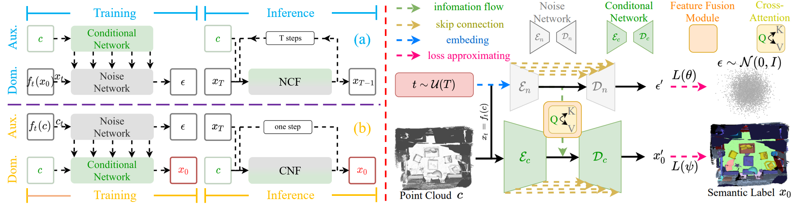
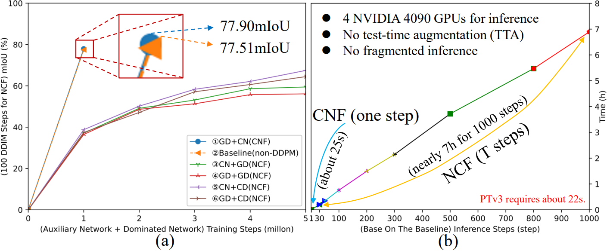
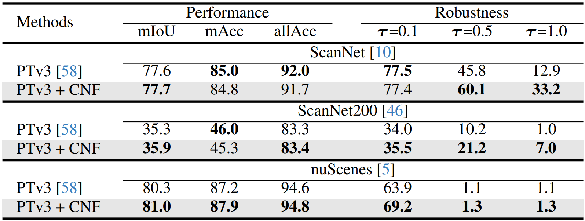

# CDSegNet

This repo is the official project repository of the paper **_An End-to-End Robust Point Cloud Semantic Segmentation Network with Single-Step Conditional Diffusion Models_**. 
 - [ [arXiv](https://arxiv.org/abs/2411.16308) ]
 - **_Our paper has been accepted by CVPR 2025!_**
 - **_Released model weights are temporarily as the model structure of CDSegNet may be adjusted later._**
## The Overall Framework 
 

## Citation
If you find our paper useful to your research, please cite our work as an acknowledgment.
```bib
@article{qu2024end,
  title={An End-to-End Robust Point Cloud Semantic Segmentation Network with Single-Step Conditional Diffusion Models},
  author={Qu, Wentao and Wang, Jing and Gong, YongShun and Huang, Xiaoshui and Xiao, Liang},
  journal={arXiv preprint arXiv:2411.16308},
  year={2024}
}
```

## Motivation
Below, we give a brief explanation of the motivation of our paper, hoping to help readers further understand our idea.

 - Traditional DDPMs excel in generative tasks but are limited to 3D perception tasks due to **_multi-step iterations_** and **_the difficulty fitting semantic label scores_**. 
 - 1) **_multi-step iterations:_** PTv3 infers on ScanNet in 22s (no test-time augmentation (TTA)), while a DDPM built on PTv3 takes nearly 7h for 1000 steps (Fig.2). Even with acceleration strategies, but: 1) suboptimal results, 2) still multi-step requirements.
 - 2) **_the difficulty of fitting semantic label scores:_** It is unrealistic to directly fit the score of point cloud semantic labels according to traditional DDPMs in an end-to-end manner, because the distribution of 3D scenes is too complex. This is similar to using DDPMs to do 3D scene generation tasks in an end-to-end manner.
 - So why do we still use DDPMs for semantic segmentation tasks? Isn’t it better for us to use non-DDPMs directly?
 - This is the main contribution of our paper. 
 - 1) **_Our paper analyzes the advantages (noise and sparsity robustness) and weaknesses (more iterations) of DDPMs in 3D perception tasks._** 
 - 2) **_We proposes CNF, a novel end-to-end framework of DDPMs that maintains performance and robustness while avoiding iterations._** 
 - **_Models with CNF still essentially qualify as DDPMs, as trained models can perform DDPM inference.The key difference from traditional DDPMs is simply the output from CN instead of NN._** 
 - As a framework, CNF is built on a backbone (e.g.~PTv3),  thus inevitably slightly increasing computational cost. However, CNF is more cost-effective compared to traditional DDPMs (NCF). 
 - Our paper's aim is not to propose a novel backbone but to **_introduce a new perspective for applying DDPMs to 3D perception tasks_** (CDSegNet is an instance of CNF).

## Explanation of Figure 2
 <br/>

- We try several combinations for conditional DDPMs built on the baseline on ScanNet in (a). The same architecture as CDSegNet(CNF,①) but using traditional DDPMs for segmentation (NCF,③,④,⑤,⑥)
- (b) shows the inference time cost of CNF and NCF under the same baseline. Due to multiple iterations, the reasoning time of NCF is even close to 7 hours.

## Overview
- [Installation](#installation)
- [Data Preparation](#data-preparation)
- [Model Zoo](#model-zoo)
- [Quick Start](#quick-start)

## Installation

### Requirements
The following environment is recommended for running **_CDSegNet_** (an NVIDIA 3090 GPU or four NVIDIA 4090 GPUs):
- Ubuntu: 18.04 and above
- gcc/g++: 11.4 and above
- CUDA: 11.8 and above
- PyTorch: 2.1.0 and above
- python: 3.8 and above

### Environment

- Base environment
```
sudo apt-get install libsparsehash-dev

conda create -n cnf python=3.8 -y
conda activate cnf
conda install ninja -y

conda install google-sparsehash -c bioconda

conda install pytorch==2.1.0 torchvision==0.16.0 torchaudio==2.1.0 pytorch-cuda=11.8 -c pytorch -c nvidia

conda install h5py pyyaml -c anaconda -y
conda install sharedarray tensorboard tensorboardx yapf addict einops scipy plyfile termcolor timm -c conda-forge -y
conda install pytorch-cluster pytorch-scatter pytorch-sparse -c pyg -y
pip install torch-geometric
pip install spconv-cu118
pip install open3d

# compile C++ extension packages
# Please ensure:
#   nvcc : 11.8
#   gcc/g++ : 11.4 
cd CDSegNet-main/scripts
sh compile.sh

# install flash-attention
# 1. cuda11.8 -> cuda11.6
#   vim ~/.bashrc
#   export PATH="/usr/local/cuda-11.8/bin:$PATH" -> export PATH="/usr/local/cuda-11.6/bin:$PATH"
#   export CUDA_HOME="/usr/local/cuda-11.8" -> export CUDA_HOME="/usr/local/cuda-11.6"
# 2. please download flash_attn-2.5.7+cu118torch2.1cxx11abiFALSE-cp38-cp38-linux_x86_64.whl from:
#      a. The official website: https://github.com/Dao-AILab/flash-attention/releases?page=2
#      b. Our links: Baidu Netdisk and Google Drive in Model Zoom
# 3. pip install flash_attn-2.5.7+cu118torch2.1cxx11abiFALSE-cp38-cp38-linux_x86_64.whl
```

## Data Preparation
- Please refer to the [data processing](https://github.com/Pointcept/Pointcept#data-preparation) of PTv3.
### ScanNet v2

The preprocessing supports semantic and instance segmentation for both `ScanNet20`, `ScanNet200`, and `ScanNet Data Efficient`.
- Download the [ScanNet](http://www.scan-net.org/) v2 dataset.
- Run preprocessing code for raw ScanNet as follows:

  ```bash
  # RAW_SCANNET_DIR: the directory of downloaded ScanNet v2 raw dataset.
  # PROCESSED_SCANNET_DIR: the directory of the processed ScanNet dataset (output dir).
  python pointcept/datasets/preprocessing/scannet/preprocess_scannet.py --dataset_root ${RAW_SCANNET_DIR} --output_root ${PROCESSED_SCANNET_DIR}
  ```
- (Optional) Download ScanNet Data Efficient files:
  ```bash
  # download-scannet.py is the official download script
  # or follow instructions here: https://kaldir.vc.in.tum.de/scannet_benchmark/data_efficient/documentation#download
  python download-scannet.py --data_efficient -o ${RAW_SCANNET_DIR}
  # unzip downloads
  cd ${RAW_SCANNET_DIR}/tasks
  unzip limited-annotation-points.zip
  unzip limited-reconstruction-scenes.zip
  # copy files to processed dataset folder
  mkdir ${PROCESSED_SCANNET_DIR}/tasks
  cp -r ${RAW_SCANNET_DIR}/tasks/points ${PROCESSED_SCANNET_DIR}/tasks
  cp -r ${RAW_SCANNET_DIR}/tasks/scenes ${PROCESSED_SCANNET_DIR}/tasks
  ```
- (Alternative) The preprocess data of PTv3 can be directly downloaded [[here](https://huggingface.co/datasets/Pointcept/scannet-compressed)], please agree the official license before download it.

- Link processed dataset to codebase:
  ```bash
  # PROCESSED_SCANNET_DIR: the directory of the processed ScanNet dataset.
  mkdir data
  ln -s ${PROCESSED_SCANNET_DIR} ${CODEBASE_DIR}/data/scannet
  ```

### ScanNet200
- Download the [ScanNet++](https://kaldir.vc.in.tum.de/scannetpp/) dataset.
- Run preprocessing code for raw ScanNet++ as follows:
  ```bash
  # RAW_SCANNETPP_DIR: the directory of downloaded ScanNet++ raw dataset.
  # PROCESSED_SCANNETPP_DIR: the directory of the processed ScanNet++ dataset (output dir).
  # NUM_WORKERS: the number of workers for parallel preprocessing.
  python pointcept/datasets/preprocessing/scannetpp/preprocess_scannetpp.py --dataset_root ${RAW_SCANNETPP_DIR} --output_root ${PROCESSED_SCANNETPP_DIR} --num_workers ${NUM_WORKERS}
  ```
- Sampling and chunking large point cloud data in train/val split as follows (only used for training):
  ```bash
  # PROCESSED_SCANNETPP_DIR: the directory of the processed ScanNet++ dataset (output dir).
  # NUM_WORKERS: the number of workers for parallel preprocessing.
  python pointcept/datasets/preprocessing/sampling_chunking_data.py --dataset_root ${PROCESSED_SCANNETPP_DIR} --grid_size 0.01 --chunk_range 6 6 --chunk_stride 3 3 --split train --num_workers ${NUM_WORKERS}
  python pointcept/datasets/preprocessing/sampling_chunking_data.py --dataset_root ${PROCESSED_SCANNETPP_DIR} --grid_size 0.01 --chunk_range 6 6 --chunk_stride 3 3 --split val --num_workers ${NUM_WORKERS}
  ```
- (Alternative) The preprocess data of PTv3 can be directly downloaded [[here](https://huggingface.co/datasets/Pointcept/scannetpp-compressed)], please agree the official license before download it.
- Link processed dataset to codebase:
  ```bash
  # PROCESSED_SCANNETPP_DIR: the directory of the processed ScanNet dataset.
  mkdir data
  ln -s ${PROCESSED_SCANNETPP_DIR} ${CODEBASE_DIR}/data/scannetpp
  ```

### nuScenes
- Download the official [NuScene](https://www.nuscenes.org/nuscenes#download) dataset (with Lidar Segmentation) and organize the downloaded files as follows:
  ```bash
  NUSCENES_DIR
  │── samples
  │── sweeps
  │── lidarseg
  ...
  │── v1.0-trainval 
  │── v1.0-test
  ```
- Run information preprocessing code (modified from OpenPCDet) for nuScenes as follows:
  ```bash
  # NUSCENES_DIR: the directory of downloaded nuScenes dataset.
  # PROCESSED_NUSCENES_DIR: the directory of processed nuScenes dataset (output dir).
  # MAX_SWEEPS: Max number of sweeps. Default: 10.
  pip install nuscenes-devkit pyquaternion
  python pointcept/datasets/preprocessing/nuscenes/preprocess_nuscenes_info.py --dataset_root ${NUSCENES_DIR} --output_root ${PROCESSED_NUSCENES_DIR} --max_sweeps ${MAX_SWEEPS} --with_camera
  ```
- (Alternative) The preprocess nuScenes information data can also be downloaded [[here](https://huggingface.co/datasets/Pointcept/nuscenes-compressed)] (only processed information, still need to download raw dataset and link to the folder), please agree the official license before download it.

- Link raw dataset to processed NuScene dataset folder:
  ```bash
  # NUSCENES_DIR: the directory of downloaded nuScenes dataset.
  # PROCESSED_NUSCENES_DIR: the directory of processed nuScenes dataset (output dir).
  ln -s ${NUSCENES_DIR} {PROCESSED_NUSCENES_DIR}/raw
  ```
  then the processed nuscenes folder is organized as follows:
  ```bash
  nuscene
  |── raw
      │── samples
      │── sweeps
      │── lidarseg
      ...
      │── v1.0-trainval
      │── v1.0-test
  |── info
  ```

- Link processed dataset to codebase.
  ```bash
  # PROCESSED_NUSCENES_DIR: the directory of processed nuScenes dataset (output dir).
  mkdir data
  ln -s ${PROCESSED_NUSCENES_DIR} ${CODEBASE_DIR}/data/nuscenes
  ```

## Model Zoo
 

### Indoor Benchmark
| Model | Benchmark | Only Training Data? | Num GPUs | Val mIoU | checkpoint |
| :---: | :---: |:---------------:| :---: | :---: | :---: |
| CDSegNet | ScanNet |     &check;     | 1,2,4 | 77.9% | [Link1](https://pan.baidu.com/s/1rAUHa4OHmT_Q1I2Pi_sVog?pwd=1111), [Link2](https://drive.google.com/drive/folders/1iRS5hMci8ZWW4uGYTmmXCBA-wwjjbjTW?usp=sharing) |
| PTv3 + CNF | ScanNet |     &check;     | 4 | 77.7% | [Link1](https://pan.baidu.com/s/1rAUHa4OHmT_Q1I2Pi_sVog?pwd=1111), [Link2](https://drive.google.com/drive/folders/1iRS5hMci8ZWW4uGYTmmXCBA-wwjjbjTW?usp=sharing) |
| PTv3 | ScanNet |     &check;     | 4 | 77.6% | [Link](https://huggingface.co/Pointcept/PointTransformerV3/tree/main/scannet-semseg-pt-v3m1-0-base/model) |
| CDSegNet | ScanNet200 |     &check;     | 4 | 36.3% | [Link1](https://pan.baidu.com/s/1rAUHa4OHmT_Q1I2Pi_sVog?pwd=1111), [Link2](https://drive.google.com/drive/folders/1iRS5hMci8ZWW4uGYTmmXCBA-wwjjbjTW?usp=sharing) |
| PTv3 + CNF | ScanNet200 | &check;  | 4 | 35.9% | [Link1](https://pan.baidu.com/s/1rAUHa4OHmT_Q1I2Pi_sVog?pwd=1111), [Link2](https://drive.google.com/drive/folders/1iRS5hMci8ZWW4uGYTmmXCBA-wwjjbjTW?usp=sharing) |
| PTv3 | ScanNet200 | &check;  | 4 | 35.3% | [Link](https://huggingface.co/Pointcept/PointTransformerV3/tree/main/scannet200-semseg-pt-v3m1-0-base/model) |

### Outdoor Benckmark
| Model | Benchmark | Only Training Data? | Num GPUs | Val mIoU | checkpoint |
| :---: | :---: |:---------------:| :---: | :---: | :---: |
| CDSegNet | nuScenes |     &check;     | 4 | 81.2% | [Link1](https://pan.baidu.com/s/1rAUHa4OHmT_Q1I2Pi_sVog?pwd=1111), [Link2](https://drive.google.com/drive/folders/1iRS5hMci8ZWW4uGYTmmXCBA-wwjjbjTW?usp=sharing) |
| PTv3 + CNF | nuScenes |     &check;     | 4 | 80.8% | [Link1](https://pan.baidu.com/s/1rAUHa4OHmT_Q1I2Pi_sVog?pwd=1111), [Link2](https://drive.google.com/drive/folders/1iRS5hMci8ZWW4uGYTmmXCBA-wwjjbjTW?usp=sharing) |
| PTv3 | nuScenes |     &check;     | 4 | 80.3% | [Link1](https://huggingface.co/Pointcept/PointTransformerV3/tree/main/nuscenes-semseg-pt-v3m1-0-base/model) |


## Quick Start

### Training
We provide two indoor datasets (ScanNet, ScanNet200) and one ourdoor dataset (nuScenes) to train CDSegNet. The results are in the 'CDSegNet-main/exp/{dataset}/{config}' folder.
GPUs and batch size are not limited. We successfully generate 77.9% mIoU on ScanNet with 1 (BS=2), 2 (BS=4), and 4 (BS=8) GPUs.
```
# Training on ScanNet
CUDA_VISIBLE_DEVICES=0,1,2,3 python tools/train_CDSegNet_ScanNet.py
# Training on ScanNet200
CUDA_VISIBLE_DEVICES=0,1,2,3 python tools/train_CDSegNet_ScanNet200.py

# Training on nuScenes
CUDA_VISIBLE_DEVICES=0,1,2,3 python tools/train_CDSegNet_nuScenes.py
```

#### Training Tricks
- CDSegNet is tied to PTv3, but we found that PTv3 training is unstable, and even with a fixed seed we cannot ensure that the results are roughly the same each time (fluctuations are around 1.0%mIoU).
- The reasons for instability are: 1) Grid pooling 2) Sparse convolution
- This once caused us headaches and sadness, because when we adjusted the parameters, we could not determine whether the poor performance was due to parameter problems or randomness problems.
- With unremitting efforts, we found a way to stabilize performance. That is to save the checkpoint in the middle, and then load the training repeatedly. For example, on ScanNet, 100 epochs are required, and we save the checkpoint at 70 epoch. Then, repeatedly train from 70 epoch to 100 epoch. This may get the most stable results.

#### Extensions
- If you want to extend our work, we recommend using PTv3+CNF instead of CDSegNet. Since PTv3+CNF has only half the parameters of CDSegNet, the performance of the two is quite close.
- We found that on the nuScene test set, PTv3+CNF achieved 82.8% mIoU (PTv3 ->81.2%, CDSegNet->82.0% mIoU) when trained only on the training set of nuScenes. PTv3+PPT showed 83.0% mIoU, but this has more than double the number of parameters of PTv3+PPT and uses multiple datasets for joint training. 

### Testing
We provide two indoor datasets (ScanNet, ScanNet200) and one ourdoor dataset (nuScenes) to train CDSegNet. The results are in the 'CDSegNet-main/exp/{dataset}_test/{config}' folder.
```
# Training on ScanNet
CUDA_VISIBLE_DEVICES=0,1,2,3 python tools/test_CDSegNet_ScanNet.py
# We also can test at a specified noise level on ScanNet:
CUDA_VISIBLE_DEVICES=0,1,2,3 python tools/test_CDSegNet_ScanNet.py noise_level = 0.1
# Training on ScanNet200
CUDA_VISIBLE_DEVICES=0,1,2,3 python tools/test_CDSegNet_ScanNet200.py

# Training on nuScenes
CUDA_VISIBLE_DEVICES=0,1,2,3 python tools/test_CDSegNet_nuScenes.py

```
